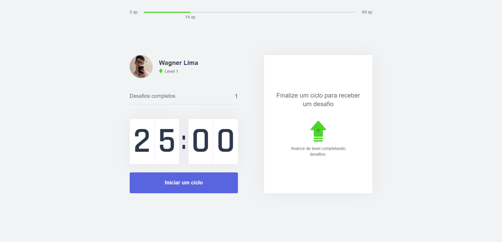
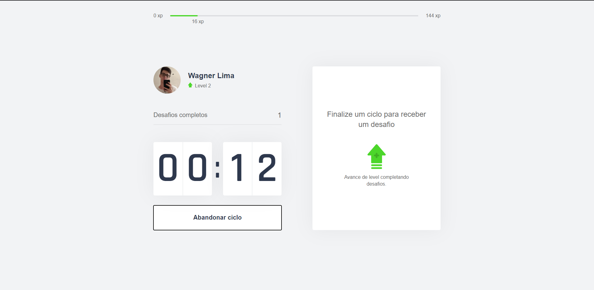
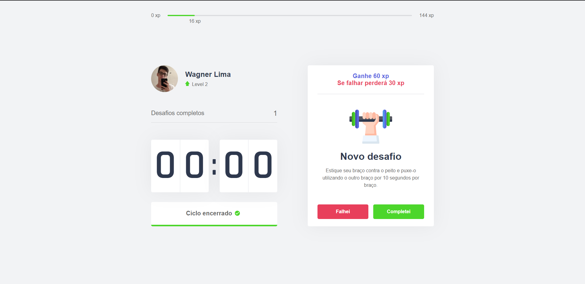

<h1 align="center"></h1>

<p align ="center">
    Sobre o projeto: Move.it é um projeto da rocketseat realizado na semana next level week
</p>


<p align="center">
    
    
    
</p>

## - Tabela de conteúdo

<ul>
    <li><a href-"#-Iniciando"></a>Iniciando a aplicação</li>
    <li><a href-"#-Novos recursos"></a>Novos recursos adicionados</li>
    <li><a href-"#-Tecnologias utilizadas"></a>Tecnologias Usadas</li>
</ul>

## - Iniciando a aplicação:

```javascript
yarn install
ou
npm install
```

---

```javascript
yarn dev
or
npv run dev
```

## - Novos recursos

- [x] Sistema de redução de exp e nivel por falha.
- [ ] Em contrução 🚧
- [ ] Em contrução 🚧

## - Tecnologias usadas


---

<h2>
    Move.It 🚀 em construção 🚧
</h2>

